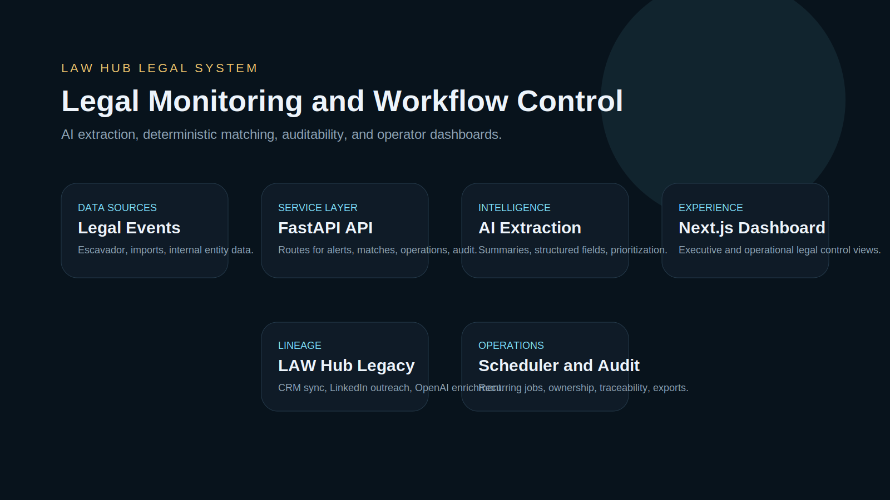

# Law Hub Legal System

`law-hub-legal-system` is a curated legal-financial intelligence platform assembled from the strongest LAW systems on this machine. It combines the modern `LAW Juridico` monitoring stack with the earlier `law-hub` prospecting workflow lineage to show a broader product story: legal data ingestion, AI enrichment, deterministic matching, operational control, and executive visibility.

## Overview

The business problem is operational fragmentation. Legal-financial teams need to monitor entities, classify risk, triage actions, and keep decision-makers aligned without manually stitching together legal feeds, spreadsheets, and internal workflow.

This system addresses that by combining:

- scheduled legal monitoring and event ingestion
- AI extraction and summarization
- deterministic matching against internal entities
- alerting, audit trails, and operational case management
- a modern web dashboard for monitoring and follow-through

## Key Features

- FastAPI API layer with route modules for alerts, audit, dashboard, entities, events, imports, matches, operations, settings, and users
- APScheduler-based orchestration for recurring monitoring workloads
- AI extraction service for structured legal summaries and risk signals
- matching engine with entity correlation and prioritization
- operational workflow layer for case ownership, aging, and next actions
- Next.js dashboard with dedicated pages for dashboard, events, matches, audit, legal control, and user management
- legacy LAW Hub lineage showing CRM sync, LinkedIn outreach, OpenAI enrichment, and prospect intelligence

## System Architecture

- `apps/api`: FastAPI, SQLAlchemy, Alembic, scheduling, matching, integrations, reporting
- `apps/web`: Next.js 15, TypeScript, Tailwind, dashboard components, mock/demo support
- `legacy/law-hub-server`: Express workflow for Pipedrive, Unipile, and OpenAI-based outreach support
- `legacy/law-hub-client-src`: earlier React client source for LAW Hub

Detailed architecture is documented in [architecture.md](C:\Users\Administrator\gabriel-saganski\law-hub-legal-system\architecture.md).

## Technologies Used

- Python
- FastAPI
- SQLAlchemy
- Alembic
- APScheduler
- PostgreSQL
- Redis
- OpenAI
- Node.js
- Next.js
- React
- Tailwind CSS
- Docker Compose

## Screenshots

## Engineering Highlights

- Production-style separation of monitoring, matching, operations, and reporting concerns
- Public-safe curation from a live local server codebase
- AI used as an acceleration layer for extraction and classification, not as the entire product
- Support for demo-friendly web delivery without depending on full backend availability
- Clear evidence of workflow depth: audit, scheduling, imports, matches, dashboarding, and exports

## Future Improvements

- Add public demo deployment backed by seeded legal events
- Extend alerting targets beyond in-app workflows
- Add CI for API tests and static web export validation
- Publish an API contract and sample datasets for external review
