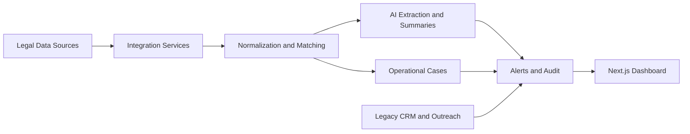

# Law Hub Legal System Architecture

## Component Model

## Backend

The API is organized as a service-oriented FastAPI application:

- routing under `app/api/routes/*`
- persistence and session handling under `app/db/*`
- domain models under `app/models/*`
- scheduled execution under `app/services/scheduler/*`
- matching logic under `app/services/matching/*`
- legal monitoring under `app/services/monitoring.py`
- exports and reporting under `app/services/exports/*`

## Frontend

The web application uses the Next.js app router and a dashboard-first information architecture:

- auth entry at `app/(auth)/login/page.tsx`
- dashboard pages for legal control, events, companies, alerts, audit, and operations
- reusable dashboard shell and data table components
- generated workbook-backed demo content for public-safe presentation

## Legacy Lineage

The `legacy/` area captures the earlier LAW Hub system's CRM and outreach automation capabilities:

- Pipedrive synchronization
- Unipile and LinkedIn outreach flows
- OpenAI-assisted enrichment and response generation
- cached state and enrichment memory

## Operational Characteristics

- Supports scheduled runs at application startup
- Designed around auditable workflows instead of one-shot scripts
- Clean candidate for Dockerized local or cloud deployment
